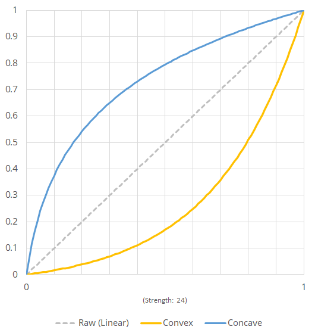
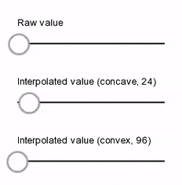

# VertigoInterpolator
VertigoInterpolator is single-file Java library that interpolates linear input of [0, 1] into concave or convex curved output on time basis.<br/>

## Example

<br/>

<br/>

## Basic usage

```java
// creates new VertigoInterpolator with given options.
VertigoInterpolator interpolator = new VertigoInterpolator(
    VertigoInterpolator.Direction.Incremental,  // direction
    VertigoInterpolator.Curvature.Concave,      // curvature
    3f,                                         // interval (seconds)
    36,                                         // strength
    VertigoInterpolator.RepeatMode.NoRepeat     // repeat mode
);

// in rendering loop or something:
while (true) {
    interpolator.update(deltaTime);
    float interpolatedValue = interpolator.getValueInterpolated();
}

// interpolatedValue will go from 0 to 1 (incremental)
// with fast acceleration on start (concave) for 3 seconds (interval).
// after 3 seconds, interpolator.update function will do nothing
// since we set its repeat mode as RepeatMode.NoRepeat.
// if it's set to anything else, you can keep calling interpolator.update()
// and get the result you want.
```

## License
VertigoInterpolator is distributed under the terms of the Do What The Fuck You Want To Public License, Version 2.